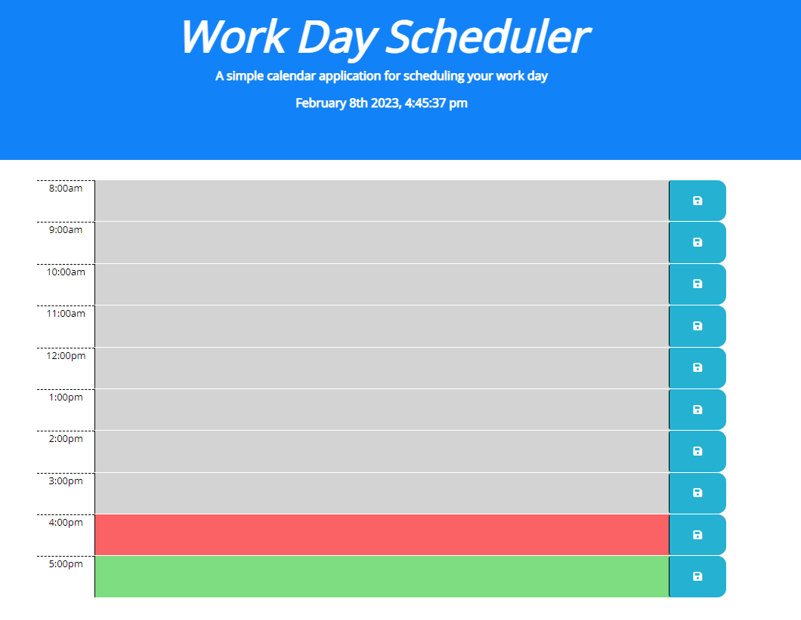

# Project: Module 5 Challenge: Browser Based Workday Planner

## Table of Contents: 
- [Module 4 Challenge: Browser Based Workday Planner](#browser-based-workday-planner)
  - [Table of Contents:](#table-of-contents)
  - [License:](#license)
  - [Description:](#description)
  - [Installation Instructions:](#installation-instructions)
  - [Github:](#github)
  - [Images:](#images)
 

## License:
See Repo for more information

## Description:
This is a day planner web application that will allow a user to keep basic track of work throughout the working day hours, typically 0800 - 1700. This application allows the user to enter and save text into any of the description fields. The data will then be saved into the browsers local storage. As the work day progresses, the hours previous to the current time wil be highlighted in gray, the current hour red, and the future hours will display green.

## Installation Instructions: 
Launch the site in the browser of your choosing.

## Github: 
Check out my repository and progress in developing skills to become a full stack developer: https://github.com/Tunestring

## Images:

